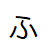

#  ふもとっぱら予約

ふもとっぱら予約 Chrome 拡張機能

## 使い方

【事前準備】  
①chromeで、「chrome://extensions/」のURLを開く。  
②右上の「デベロッパーモード」をONにする。  
③「パッケージ化されていない拡張機能を読み込む」で、buildディレクトリを読み込む。  
④右上のツールバー内の拡張機能アイコンをクリックして、Fumotopparaをピン止めする。  
⑤右上のツールバー内の「ふ」アイコンをクリックし、必要事項を事前に入力しておく。  
  
【使用方法】  
①予約開始時間になったら、「https://fumotoppara.secure.force.com/」を開き、該当日付を選ぶ。  
②右上のツールバー内の「ふ」アイコンをクリックし、「クリックで予約画面」ボタンをクリックする。  
③事前に入力してた内容が反映されるので、画面最下部のの「次へすすむ」ボタンから速やかに予約を完了させる。  

## Install

[**Chrome** extension]()

## Contribution

Suggestions and pull requests are welcomed!.

---

This project was bootstrapped with [Chrome Extension CLI](https://github.com/dutiyesh/chrome-extension-cli)

